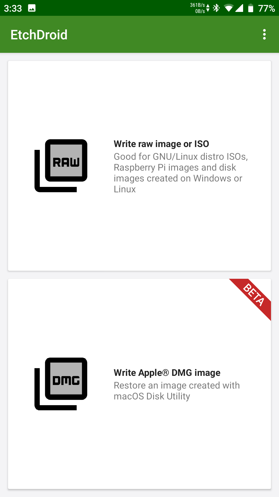
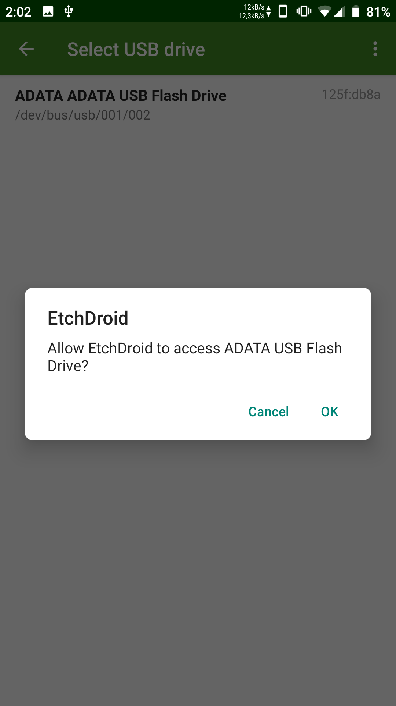
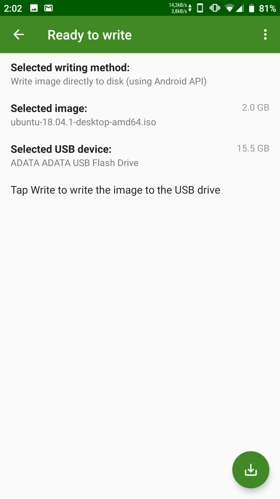
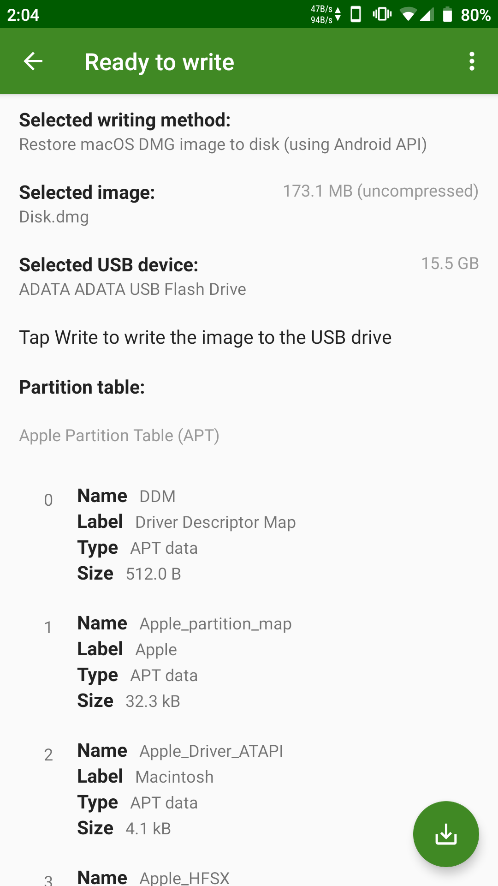
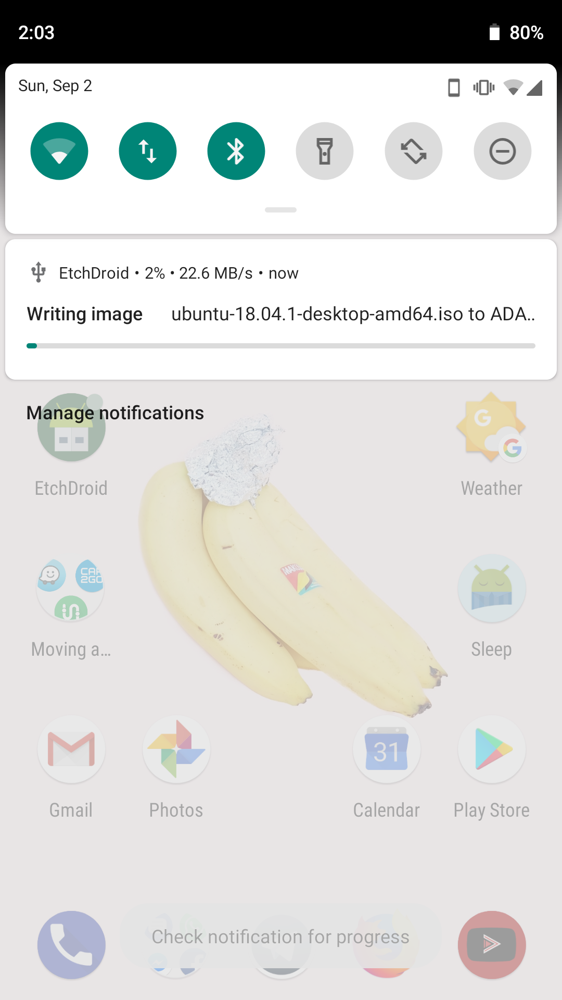
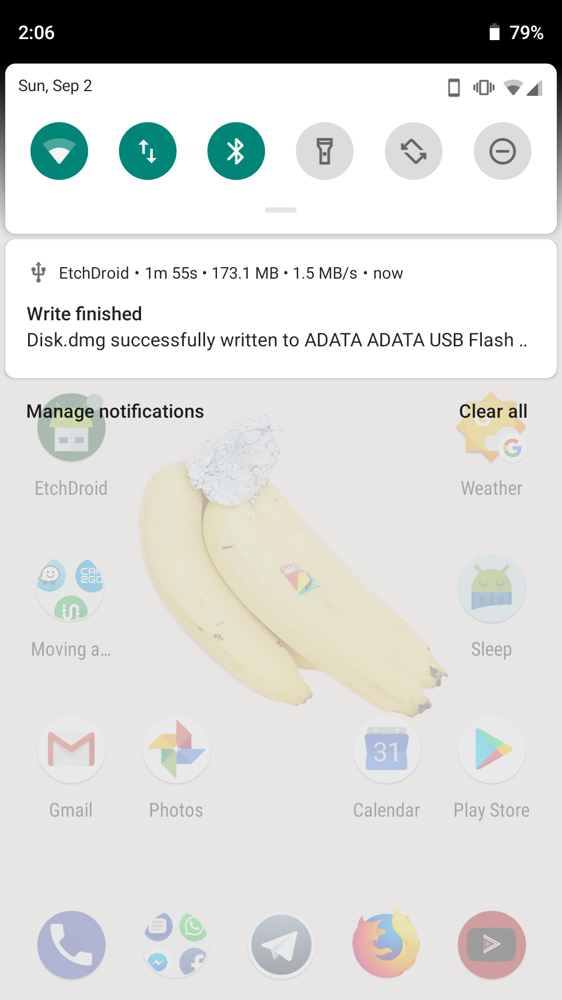

# EtchDroid

# WINDOWS ISOs ARE \*\*NOT\*\* SUPPORTED!
# DO NOT REPORT ISSUES IF YOU'RE FLASHING A WINDOWS INSTALLER IMAGE. IT'S FUCKING SIMPLE. SEE ISSUE [#5](https://github.com/EtchDroid/EtchDroid/issues/5)

      

 

## Updates on development status
Check out my blog: https://blog.depau.eu/tag/etchdroid/

EtchDroid is an open-source application that helps you write images to USB drives, no root required.

You can use it to make a bootable GNU/Linux USB drive when your laptop is dead and you're in the middle of nowhere.

 &nbsp;&nbsp;&nbsp; 

## Features
- Supports raw disk images and most GNU/Linux distributions ISOs
- Supports most DMG disk images (beta)
- No root - everything is done within the bounds of the Android API
- Free as in freedom

## Planned features
- Write common GNU/Linux distro in streaming from the Internet without storing it on the device
- Support for Windows installation ISO (will likely require root)
- Support for Unetbootin-style image flashing

## Screenshots

<!-- Exact dimensions are specified to avoid the images jumping as they load -->
<!-- The "force inline" comment ensures the images stay inline, the fact that it's needed might be a GFM bug -->
 <!-- Force inline -->
 <!-- Force inline -->
 <!-- Force inline -->
 <!-- Force inline -->
 <!-- Force inline -->
 <!-- Force inline -->

## Support the project

You can support the development by sending a donation.

See the website: https://etchdroid.depau.eu/donate/

## FAQ/Common issues

See the website: https://etchdroid.depau.eu/faq/

