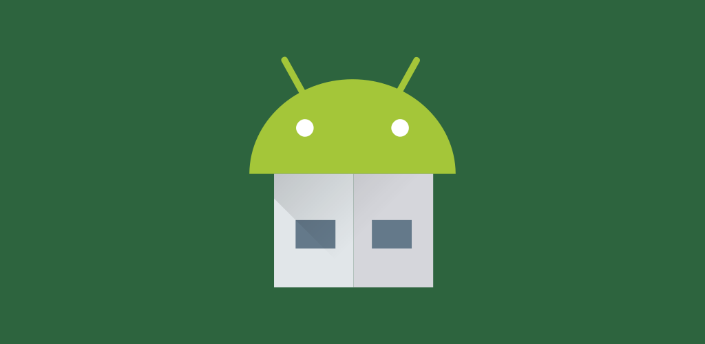

# EtchDroid

EtchDroid is an open-source application that helps you write images to USB drives, no root required.

You can use it to make a bootable GNU/Linux USB drive when your laptop is dead and you're in the middle of nowhere.

[Download from Google Play](https://play.google.com/store/apps/details?id=eu.depau.etchdroid) (soon on F-Droid)

## Features
- Supports raw disk images and most GNU/Linux distributions ISOs
- Supports most DMG disk images (beta)
- No root - everything is done within the bounds of the Android API
- Free as in freedom

## Planned features:
- Write common GNU/Linux distro in streaming from the Internet without storing it on the device
- Support for Windows installation ISO (will likely require root)
- Support for Unetbootin-style image flashing